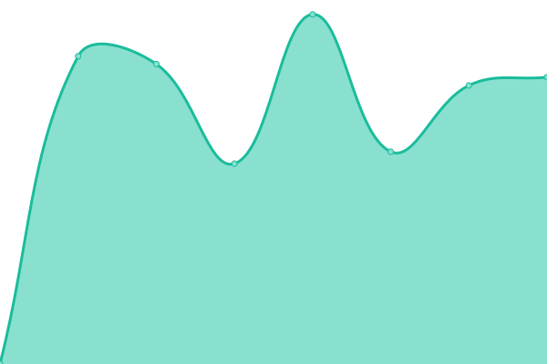
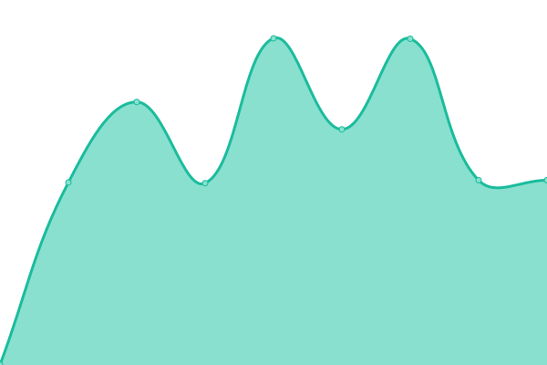

# Gensokyo Service Status

Status: <!--live status--> **🟧 Partial outage**

Web version: https://status.soopy.moe

<!--start: status pages-->
<!-- This summary is generated by Upptime (https://github.com/upptime/upptime) -->
<!-- Do not edit this manually, your changes will be overwritten -->
<!-- prettier-ignore -->
| URL | Status | History | Response Time | Uptime |
| --- | ------ | ------- | ------------- | ------ |
|  [Cloudflare lol](https://soopy.moe) | 🟩 Up | [cloudflare-lol.yml](https://github.com/soopyc/upgraded-lamp/commits/HEAD/history/cloudflare-lol.yml) | 

 241ms
     
 | 

<a href="https://status.soopy.moe/history/cloudflare-lol">99.82%</a>
    

|  [Fallback/Landing site](https://gensokyo.soopy.moe) | 🟩 Up | [fallback-landing-site.yml](https://github.com/soopyc/upgraded-lamp/commits/HEAD/history/fallback-landing-site.yml) | 

 775ms
     
 | 

<a href="https://status.soopy.moe/history/fallback-landing-site">99.37%</a>
    

|  [Bibliogram](https://bib.soopy.moe) | 🟩 Up | [bibliogram.yml](https://github.com/soopyc/upgraded-lamp/commits/HEAD/history/bibliogram.yml) | 

 712ms
     
 | 

<a href="https://status.soopy.moe/history/bibliogram">99.74%</a>
    

|  [Invidious](https://iv.soopy.moe) | 🟩 Up | [invidious.yml](https://github.com/soopyc/upgraded-lamp/commits/HEAD/history/invidious.yml) | 

 1075ms
     
 | 

<a href="https://status.soopy.moe/history/invidious">100.00%</a>
    

|  [Nitter](https://nitter.soopy.moe) | 🟩 Up | [nitter.yml](https://github.com/soopyc/upgraded-lamp/commits/HEAD/history/nitter.yml) | 

 727ms
     
 | 

<a href="https://status.soopy.moe/history/nitter">100.00%</a>
    

|  [Linux package mirror](https://keine.soopy.moe) | 🟩 Up | [linux-package-mirror.yml](https://github.com/soopyc/upgraded-lamp/commits/HEAD/history/linux-package-mirror.yml) | 

 721ms
     
 | 

<a href="https://status.soopy.moe/history/linux-package-mirror">100.00%</a>
    

|  [Sanae package repository](https://sanae.soopy.moe) | 🟩 Up | [sanae-package-repository.yml](https://github.com/soopyc/upgraded-lamp/commits/HEAD/history/sanae-package-repository.yml) | 

 677ms
     
 | 

<a href="https://status.soopy.moe/history/sanae-package-repository">99.82%</a>
    

|  [Asset server](https://assets.soopy.moe) | 🟩 Up | [asset-server.yml](https://github.com/soopyc/upgraded-lamp/commits/HEAD/history/asset-server.yml) | 

 642ms
     
 | 

<a href="https://status.soopy.moe/history/asset-server">99.82%</a>
    

|  [Hastebin](https://aya.soopy.moe) | 🟩 Up | [hastebin.yml](https://github.com/soopyc/upgraded-lamp/commits/HEAD/history/hastebin.yml) | 

 1051ms
     
 | 

<a href="https://status.soopy.moe/history/hastebin">99.01%</a>
    

|  [Chibisafe](https://chen.soopy.moe) | 🟩 Up | [chibisafe.yml](https://github.com/soopyc/upgraded-lamp/commits/HEAD/history/chibisafe.yml) | 

 1874ms
     
 | 

<a href="https://status.soopy.moe/history/chibisafe">99.40%</a>
    

|  [Weblate](https://hatate.soopy.moe) | 🟩 Up | [weblate.yml](https://github.com/soopyc/upgraded-lamp/commits/HEAD/history/weblate.yml) | 

 3794ms
     
 | 

<a href="https://status.soopy.moe/history/weblate">99.21%</a>
    

|  [GitLab](https://koakuma.soopy.moe) | 🟩 Up | [git-lab.yml](https://github.com/soopyc/upgraded-lamp/commits/HEAD/history/git-lab.yml) | 

 2998ms
     
 | 

<a href="https://status.soopy.moe/history/git-lab">92.33%</a>
    

|  [Docker Registry](https://wailord.soopy.moe/v2/) | 🟩 Up | [docker-registry.yml](https://github.com/soopyc/upgraded-lamp/commits/HEAD/history/docker-registry.yml) | 

 655ms
     
 | 

<a href="https://status.soopy.moe/history/docker-registry">99.06%</a>
    

|  [Mochi](https://mochi.soopy.moe) | 🟩 Up | [mochi.yml](https://github.com/soopyc/upgraded-lamp/commits/HEAD/history/mochi.yml) | 

 722ms
     
 | 

<a href="https://status.soopy.moe/history/mochi">100.00%</a>
    

|  [Hatate](https://hatate.soopy.moe) | 🟩 Up | [hatate.yml](https://github.com/soopyc/upgraded-lamp/commits/HEAD/history/hatate.yml) | 

 709ms
     
 | 

<a href="https://status.soopy.moe/history/hatate">99.27%</a>
    

|  [Synthesis Shortlinking](https://s.soopy.moe) | 🟩 Up | [synthesis-shortlinking.yml](https://github.com/soopyc/upgraded-lamp/commits/HEAD/history/synthesis-shortlinking.yml) | 

 832ms
     
 | 

<a href="https://status.soopy.moe/history/synthesis-shortlinking">98.97%</a>
    

|  [Cockpit](https://reimu.soopy.moe) | 🟩 Up | [cockpit.yml](https://github.com/soopyc/upgraded-lamp/commits/HEAD/history/cockpit.yml) | 

 1286ms
     
 | 

<a href="https://status.soopy.moe/history/cockpit">99.26%</a>
    

|  [Portainer](https://momiji.soopy.moe) | 🟩 Up | [portainer.yml](https://github.com/soopyc/upgraded-lamp/commits/HEAD/history/portainer.yml) | 

 702ms
     
 | 

<a href="https://status.soopy.moe/history/portainer">99.54%</a>
    

|  [Grafana](https://suika.soopy.moe) | 🟩 Up | [grafana.yml](https://github.com/soopyc/upgraded-lamp/commits/HEAD/history/grafana.yml) | 

 1225ms
     
 | 

<a href="https://status.soopy.moe/history/grafana">99.36%</a>
    

|  [GlitchTip](https://kaguya.soopy.moe) | 🟩 Up | [glitch-tip.yml](https://github.com/soopyc/upgraded-lamp/commits/HEAD/history/glitch-tip.yml) | 

 1413ms
     
 | 

<a href="https://status.soopy.moe/history/glitch-tip">99.44%</a>
    

|  [Matrix (Synapse)](https://nue.soopy.moe/_matrix/federation/v1/version) | 🟩 Up | [matrix-synapse.yml](https://github.com/soopyc/upgraded-lamp/commits/HEAD/history/matrix-synapse.yml) | 

 639ms
     
 | 

<a href="https://status.soopy.moe/history/matrix-synapse">100.00%</a>
    

|  [Matrix (staging, Dendrite)](https://nue-staging.soopy.moe/_matrix/federation/v1/version) | 🟩 Up | [matrix-staging-dendrite.yml](https://github.com/soopyc/upgraded-lamp/commits/HEAD/history/matrix-staging-dendrite.yml) | 

 626ms
     
 | 

<a href="https://status.soopy.moe/history/matrix-staging-dendrite">99.56%</a>
    

|  [Misskey](https://m.soopy.moe) | 🟩 Up | [misskey.yml](https://github.com/soopyc/upgraded-lamp/commits/HEAD/history/misskey.yml) | 

 889ms
     
 | 

<a href="https://status.soopy.moe/history/misskey">99.66%</a>
    

|  [Kroki](https://kroki.soopy.moe) | 🟩 Up | [kroki.yml](https://github.com/soopyc/upgraded-lamp/commits/HEAD/history/kroki.yml) | 

 1053ms
     
 | 

<a href="https://status.soopy.moe/history/kroki">99.39%</a>
    

|  [OSM Tile Server](https://kosuzu.soopy.moe/hk-tw/) | 🟥 Down | [osm-tile-server.yml](https://github.com/soopyc/upgraded-lamp/commits/HEAD/history/osm-tile-server.yml) | 

 1067ms
     
 | 

<a href="https://status.soopy.moe/history/osm-tile-server">92.75%</a>
    

<!--end: status pages-->
