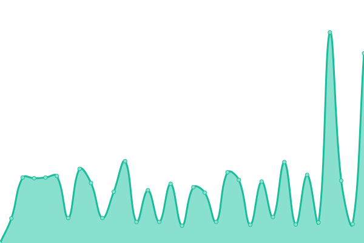

# Gensokyo Service Status

Status: <!--live status--> **🟧 Partial outage**

Web version: https://status.soopy.moe

<!--start: status pages-->
<!-- This summary is generated by Upptime (https://github.com/upptime/upptime) -->
<!-- Do not edit this manually, your changes will be overwritten -->
<!-- prettier-ignore -->
| URL | Status | History | Response Time | Uptime |
| --- | ------ | ------- | ------------- | ------ |
|  [Cloudflare lol](https://soopy.moe) | 🟩 Up | [cloudflare-lol.yml](https://github.com/soopyc/upgraded-lamp/commits/HEAD/history/cloudflare-lol.yml) | 

 268ms
     
 | 

<a href="https://status.soopy.moe/history/cloudflare-lol">100.00%</a>
    

|  [Fallback/Landing site](https://gensokyo.soopy.moe) | 🟩 Up | [fallback-landing-site.yml](https://github.com/soopyc/upgraded-lamp/commits/HEAD/history/fallback-landing-site.yml) | 

 802ms
     
 | 

<a href="https://status.soopy.moe/history/fallback-landing-site">100.00%</a>
    

|  [Bibliogram](https://bib.soopy.moe) | 🟥 Down | [bibliogram.yml](https://github.com/soopyc/upgraded-lamp/commits/HEAD/history/bibliogram.yml) | 

 1848ms
     
 | 

<a href="https://status.soopy.moe/history/bibliogram">0.00%</a>
    

|  [Nitter](https://nitter.soopy.moe) | 🟩 Up | [nitter.yml](https://github.com/soopyc/upgraded-lamp/commits/HEAD/history/nitter.yml) | 

 654ms
     
 | 

<a href="https://status.soopy.moe/history/nitter">100.00%</a>
    

|  [Lanyard](https://shitcord.soopy.moe/397029587965575170.png) | 🟩 Up | [lanyard.yml](https://github.com/soopyc/upgraded-lamp/commits/HEAD/history/lanyard.yml) | 

 1695ms
     
 | 

<a href="https://status.soopy.moe/history/lanyard">100.00%</a>
    

|  [Rimgo](https://pics.soopy.moe) | 🟩 Up | [rimgo.yml](https://github.com/soopyc/upgraded-lamp/commits/HEAD/history/rimgo.yml) | 

 776ms
     
 | 

<a href="https://status.soopy.moe/history/rimgo">100.00%</a>
    

|  [Piped](https://piped.soopy.moe) | 🟩 Up | [piped.yml](https://github.com/soopyc/upgraded-lamp/commits/HEAD/history/piped.yml) | 

 661ms
     
 | 

<a href="https://status.soopy.moe/history/piped">100.00%</a>
    

|  [Piped Proxy](https://p.piped.soopy.moe) | 🟩 Up | [piped-proxy.yml](https://github.com/soopyc/upgraded-lamp/commits/HEAD/history/piped-proxy.yml) | 

 642ms
     
 | 

<a href="https://status.soopy.moe/history/piped-proxy">100.00%</a>
    

|  [Piped Backend](https://b.piped.soopy.moe/status) | 🟩 Up | [piped-backend.yml](https://github.com/soopyc/upgraded-lamp/commits/HEAD/history/piped-backend.yml) | 

 632ms
     
 | 

<a href="https://status.soopy.moe/history/piped-backend">100.00%</a>
    

|  [Linux package mirror](https://keine.soopy.moe) | 🟩 Up | [linux-package-mirror.yml](https://github.com/soopyc/upgraded-lamp/commits/HEAD/history/linux-package-mirror.yml) | 

 687ms
     
 | 

<a href="https://status.soopy.moe/history/linux-package-mirror">100.00%</a>
    

|  [Sanae package repository](https://sanae.soopy.moe) | 🟩 Up | [sanae-package-repository.yml](https://github.com/soopyc/upgraded-lamp/commits/HEAD/history/sanae-package-repository.yml) | 

 744ms
     
 | 

<a href="https://status.soopy.moe/history/sanae-package-repository">100.00%</a>
    

|  [Asset server](https://assets.soopy.moe) | 🟩 Up | [asset-server.yml](https://github.com/soopyc/upgraded-lamp/commits/HEAD/history/asset-server.yml) | 

 742ms
     
 | 

<a href="https://status.soopy.moe/history/asset-server">100.00%</a>
    

|  [Hastebin](https://aya.soopy.moe) | 🟩 Up | [hastebin.yml](https://github.com/soopyc/upgraded-lamp/commits/HEAD/history/hastebin.yml) | 

 628ms
     
 | 

<a href="https://status.soopy.moe/history/hastebin">100.00%</a>
    

|  [Chibisafe](https://chen.soopy.moe) | 🟩 Up | [chibisafe.yml](https://github.com/soopyc/upgraded-lamp/commits/HEAD/history/chibisafe.yml) | 

 796ms
     
 | 

<a href="https://status.soopy.moe/history/chibisafe">100.00%</a>
    

|  [Weblate](https://hatate.soopy.moe) | 🟩 Up | [weblate.yml](https://github.com/soopyc/upgraded-lamp/commits/HEAD/history/weblate.yml) | 

 1156ms
     
 | 

<a href="https://status.soopy.moe/history/weblate">100.00%</a>
    

|  [GitLab](https://koakuma.soopy.moe) | 🟩 Up | [git-lab.yml](https://github.com/soopyc/upgraded-lamp/commits/HEAD/history/git-lab.yml) | 

 1814ms
     
 | 

<a href="https://status.soopy.moe/history/git-lab">100.00%</a>
    

|  [Docker Registry](https://wailord.soopy.moe/v2/) | 🟩 Up | [docker-registry.yml](https://github.com/soopyc/upgraded-lamp/commits/HEAD/history/docker-registry.yml) | 

 697ms
     
 | 

<a href="https://status.soopy.moe/history/docker-registry">100.00%</a>
    

|  [BangPlayer](https://bp.soopy.moe) | 🟩 Up | [bang-player.yml](https://github.com/soopyc/upgraded-lamp/commits/HEAD/history/bang-player.yml) | 

 683ms
     
 | 

<a href="https://status.soopy.moe/history/bang-player">100.00%</a>
    

|  [Bestdori Proxy](https://bp.soopy.moe/_p/assets/jp/musicjacket/musicjacket20_rip/assets-star-forassetbundle-startapp-musicjacket-musicjacket20-hashikimi-jacket.png) | 🟩 Up | [bestdori-proxy.yml](https://github.com/soopyc/upgraded-lamp/commits/HEAD/history/bestdori-proxy.yml) | 

 121ms
     
 | 

<a href="https://status.soopy.moe/history/bestdori-proxy">100.00%</a>
    

|  [Mochi](https://mochi.soopy.moe) | 🟩 Up | [mochi.yml](https://github.com/soopyc/upgraded-lamp/commits/HEAD/history/mochi.yml) | 

 685ms
     
 | 

<a href="https://status.soopy.moe/history/mochi">100.00%</a>
    

|  [Hatate](https://hatate.soopy.moe) | 🟩 Up | [hatate.yml](https://github.com/soopyc/upgraded-lamp/commits/HEAD/history/hatate.yml) | 

 1027ms
     
 | 

<a href="https://status.soopy.moe/history/hatate">100.00%</a>
    

|  [Synthesis Shortlinking](https://s.soopy.moe) | 🟩 Up | [synthesis-shortlinking.yml](https://github.com/soopyc/upgraded-lamp/commits/HEAD/history/synthesis-shortlinking.yml) | 

 825ms
     
 | 

<a href="https://status.soopy.moe/history/synthesis-shortlinking">100.00%</a>
    

|  [Cockpit](https://reimu.soopy.moe) | 🟩 Up | [cockpit.yml](https://github.com/soopyc/upgraded-lamp/commits/HEAD/history/cockpit.yml) | 

 1526ms
     
 | 

<a href="https://status.soopy.moe/history/cockpit">100.00%</a>
    

|  [Portainer](https://momiji.soopy.moe) | 🟩 Up | [portainer.yml](https://github.com/soopyc/upgraded-lamp/commits/HEAD/history/portainer.yml) | 

 826ms
     
 | 

<a href="https://status.soopy.moe/history/portainer">100.00%</a>
    

|  [Grafana](https://suika.soopy.moe) | 🟩 Up | [grafana.yml](https://github.com/soopyc/upgraded-lamp/commits/HEAD/history/grafana.yml) | 

 1268ms
     
 | 

<a href="https://status.soopy.moe/history/grafana">100.00%</a>
    

|  [GlitchTip](https://kaguya.soopy.moe) | 🟩 Up | [glitch-tip.yml](https://github.com/soopyc/upgraded-lamp/commits/HEAD/history/glitch-tip.yml) | 

 920ms
     
 | 

<a href="https://status.soopy.moe/history/glitch-tip">100.00%</a>
    

|  [Matrix (Synapse)](https://nue.soopy.moe/_matrix/federation/v1/version) | 🟩 Up | [matrix-synapse.yml](https://github.com/soopyc/upgraded-lamp/commits/HEAD/history/matrix-synapse.yml) | 

 623ms
     
 | 

<a href="https://status.soopy.moe/history/matrix-synapse">100.00%</a>
    

|  [Matrix (staging, Dendrite)](https://nue-staging.soopy.moe/_matrix/federation/v1/version) | 🟩 Up | [matrix-staging-dendrite.yml](https://github.com/soopyc/upgraded-lamp/commits/HEAD/history/matrix-staging-dendrite.yml) | 

 625ms
     
 | 

<a href="https://status.soopy.moe/history/matrix-staging-dendrite">100.00%</a>
    

|  [Misskey](https://m.soopy.moe) | 🟩 Up | [misskey.yml](https://github.com/soopyc/upgraded-lamp/commits/HEAD/history/misskey.yml) | 

 768ms
     
 | 

<a href="https://status.soopy.moe/history/misskey">100.00%</a>
    

|  [Kroki](https://kroki.soopy.moe) | 🟩 Up | [kroki.yml](https://github.com/soopyc/upgraded-lamp/commits/HEAD/history/kroki.yml) | 

 1088ms
     
 | 

<a href="https://status.soopy.moe/history/kroki">100.00%</a>
    

|  [OSM Tile Server](https://kosuzu.soopy.moe/hk-tw/) | 🟥 Down | [osm-tile-server.yml](https://github.com/soopyc/upgraded-lamp/commits/HEAD/history/osm-tile-server.yml) | 

 1694ms
     
 | 

<a href="https://status.soopy.moe/history/osm-tile-server">100.00%</a>
    

<!--end: status pages-->
