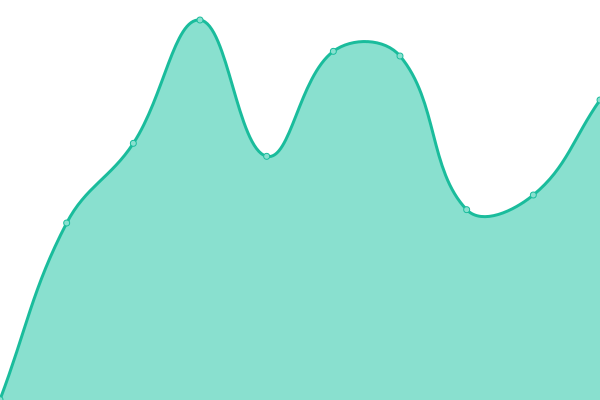
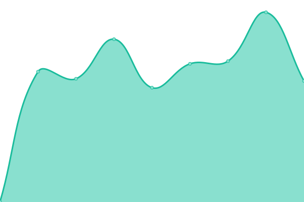

# Gensokyo Service Status

Status: <!--live status--> **🟧 Partial outage**

Web version: https://status.soopy.moe

<!--start: status pages-->
<!-- This summary is generated by Upptime (https://github.com/upptime/upptime) -->
<!-- Do not edit this manually, your changes will be overwritten -->
<!-- prettier-ignore -->
| URL | Status | History | Response Time | Uptime |
| --- | ------ | ------- | ------------- | ------ |
|  [CV site](https://soopy.moe) | 🟥 Down | [cv-site.yml](https://github.com/soopyc/upgraded-lamp/commits/HEAD/history/cv-site.yml) | 

 1361ms
     
 | 

<a href="https://status.soopy.moe/history/cv-site">99.86%</a>
    

|  [Fallback/Landing site](https://gensokyo.soopy.moe) | 🟥 Down | [fallback-landing-site.yml](https://github.com/soopyc/upgraded-lamp/commits/HEAD/history/fallback-landing-site.yml) | 

 1528ms
     
 | 

<a href="https://status.soopy.moe/history/fallback-landing-site">99.10%</a>
    

|  [Nitter](https://nitter.soopy.moe) | 🟥 Down | [nitter.yml](https://github.com/soopyc/upgraded-lamp/commits/HEAD/history/nitter.yml) | 

 829ms
     
 | 

<a href="https://status.soopy.moe/history/nitter">71.57%</a>
    

|  [Lanyard](https://shitcord.soopy.moe/397029587965575170.png) | 🟥 Down | [lanyard.yml](https://github.com/soopyc/upgraded-lamp/commits/HEAD/history/lanyard.yml) | 

 1287ms
     
 | 

<a href="https://status.soopy.moe/history/lanyard">0.00%</a>
    

|  [Rimgo](https://pics.soopy.moe) | 🟥 Down | [rimgo.yml](https://github.com/soopyc/upgraded-lamp/commits/HEAD/history/rimgo.yml) | 

 822ms
     
 | 

<a href="https://status.soopy.moe/history/rimgo">98.90%</a>
    

|  [Piped](https://piped.soopy.moe) | 🟥 Down | [piped.yml](https://github.com/soopyc/upgraded-lamp/commits/HEAD/history/piped.yml) | 

 813ms
     
 | 

<a href="https://status.soopy.moe/history/piped">99.10%</a>
    

|  [Piped Proxy](https://p.piped.soopy.moe) | 🟥 Down | [piped-proxy.yml](https://github.com/soopyc/upgraded-lamp/commits/HEAD/history/piped-proxy.yml) | 

 879ms
     
 | 

<a href="https://status.soopy.moe/history/piped-proxy">98.86%</a>
    

|  [Piped Backend](https://b.piped.soopy.moe/status) | 🟥 Down | [piped-backend.yml](https://github.com/soopyc/upgraded-lamp/commits/HEAD/history/piped-backend.yml) | 

 1122ms
     
 | 

<a href="https://status.soopy.moe/history/piped-backend">99.16%</a>
    

|  [BreezeWiki](https://breeze.soopy.moe) | 🟥 Down | [breeze-wiki.yml](https://github.com/soopyc/upgraded-lamp/commits/HEAD/history/breeze-wiki.yml) | 

 709ms
     
 | 

<a href="https://status.soopy.moe/history/breeze-wiki">99.54%</a>
    

|  [Linux package mirror](https://keine.soopy.moe) | 🟥 Down | [linux-package-mirror.yml](https://github.com/soopyc/upgraded-lamp/commits/HEAD/history/linux-package-mirror.yml) | 

 668ms
     
 | 

<a href="https://status.soopy.moe/history/linux-package-mirror">99.62%</a>
    

|  [Sanae package repository](https://sanae.soopy.moe) | 🟥 Down | [sanae-package-repository.yml](https://github.com/soopyc/upgraded-lamp/commits/HEAD/history/sanae-package-repository.yml) | 

 739ms
     
 | 

<a href="https://status.soopy.moe/history/sanae-package-repository">99.63%</a>
    

|  [Asset server](https://assets.soopy.moe) | 🟥 Down | [asset-server.yml](https://github.com/soopyc/upgraded-lamp/commits/HEAD/history/asset-server.yml) | 

 725ms
     
 | 

<a href="https://status.soopy.moe/history/asset-server">72.28%</a>
    

|  [Pasty](https://aya.soopy.moe) | 🟥 Down | [pasty.yml](https://github.com/soopyc/upgraded-lamp/commits/HEAD/history/pasty.yml) | 

 690ms
     
 | 

<a href="https://status.soopy.moe/history/pasty">72.18%</a>
    

|  [Zer0bin](https://p.soopy.moe) | 🟥 Down | [zer0bin.yml](https://github.com/soopyc/upgraded-lamp/commits/HEAD/history/zer0bin.yml) | 

 710ms
     
 | 

<a href="https://status.soopy.moe/history/zer0bin">72.31%</a>
    

|  [Chibisafe](https://chen.soopy.moe) | 🟥 Down | [chibisafe.yml](https://github.com/soopyc/upgraded-lamp/commits/HEAD/history/chibisafe.yml) | 

 2231ms
     
 | 

<a href="https://status.soopy.moe/history/chibisafe">99.25%</a>
    

|  [Weblate](https://akyuu.soopy.moe) | 🟥 Down | [weblate.yml](https://github.com/soopyc/upgraded-lamp/commits/HEAD/history/weblate.yml) | 

 1979ms
     
 | 

<a href="https://status.soopy.moe/history/weblate">98.69%</a>
    

|  [GitLab](https://koakuma.soopy.moe) | 🟥 Down | [git-lab.yml](https://github.com/soopyc/upgraded-lamp/commits/HEAD/history/git-lab.yml) | 

 2783ms
     
 | 

<a href="https://status.soopy.moe/history/git-lab">99.02%</a>
    

|  [Gitea](https://patchy.soopy.moe) | 🟥 Down | [gitea.yml](https://github.com/soopyc/upgraded-lamp/commits/HEAD/history/gitea.yml) | 

 903ms
     
 | 

<a href="https://status.soopy.moe/history/gitea">99.58%</a>
    

|  [Docker Registry](https://wailord.soopy.moe/v2/) | 🟥 Down | [docker-registry.yml](https://github.com/soopyc/upgraded-lamp/commits/HEAD/history/docker-registry.yml) | 

 1212ms
     
 | 

<a href="https://status.soopy.moe/history/docker-registry">99.43%</a>
    

|  [BangPlayer](https://bp.soopy.moe) | 🟥 Down | [bang-player.yml](https://github.com/soopyc/upgraded-lamp/commits/HEAD/history/bang-player.yml) | 

 943ms
     
 | 

<a href="https://status.soopy.moe/history/bang-player">72.33%</a>
    

|  [Bestdori Proxy](https://bp.soopy.moe/_p/assets/jp/musicjacket/musicjacket20_rip/assets-star-forassetbundle-startapp-musicjacket-musicjacket20-hashikimi-jacket.png) | 🟩 Up | [bestdori-proxy.yml](https://github.com/soopyc/upgraded-lamp/commits/HEAD/history/bestdori-proxy.yml) | 

 805ms
     
 | 

<a href="https://status.soopy.moe/history/bestdori-proxy">72.46%</a>
    

|  [Mochi](https://mochi.soopy.moe) | 🟥 Down | [mochi.yml](https://github.com/soopyc/upgraded-lamp/commits/HEAD/history/mochi.yml) | 

 778ms
     
 | 

<a href="https://status.soopy.moe/history/mochi">72.35%</a>
    

|  [Synthesis Shortlinking](https://s.soopy.moe) | 🟩 Up | [synthesis-shortlinking.yml](https://github.com/soopyc/upgraded-lamp/commits/HEAD/history/synthesis-shortlinking.yml) | 

 814ms
     
 | 

<a href="https://status.soopy.moe/history/synthesis-shortlinking">72.48%</a>
    

|  [Cockpit](https://reimu.soopy.moe) | 🟥 Down | [cockpit.yml](https://github.com/soopyc/upgraded-lamp/commits/HEAD/history/cockpit.yml) | 

 0ms
     
 | 

<a href="https://status.soopy.moe/history/cockpit">66.99%</a>
    

|  [Portainer](https://momiji.soopy.moe) | 🟥 Down | [portainer.yml](https://github.com/soopyc/upgraded-lamp/commits/HEAD/history/portainer.yml) | 

 927ms
     
 | 

<a href="https://status.soopy.moe/history/portainer">99.47%</a>
    

|  [Grafana](https://suika.soopy.moe) | 🟩 Up | [grafana.yml](https://github.com/soopyc/upgraded-lamp/commits/HEAD/history/grafana.yml) | 

 1991ms
     
 | 

<a href="https://status.soopy.moe/history/grafana">99.54%</a>
    

|  [GlitchTip](https://kaguya.soopy.moe) | 🟥 Down | [glitch-tip.yml](https://github.com/soopyc/upgraded-lamp/commits/HEAD/history/glitch-tip.yml) | 

 873ms
     
 | 

<a href="https://status.soopy.moe/history/glitch-tip">99.36%</a>
    

|  [Matrix (Synapse)](https://nue.soopy.moe/_matrix/federation/v1/version) | 🟥 Down | [matrix-synapse.yml](https://github.com/soopyc/upgraded-lamp/commits/HEAD/history/matrix-synapse.yml) | 

 688ms
     
 | 

<a href="https://status.soopy.moe/history/matrix-synapse">72.15%</a>
    

|  [Matrix (staging, Dendrite)](https://nue-staging.soopy.moe/_matrix/federation/v1/version) | 🟥 Down | [matrix-staging-dendrite.yml](https://github.com/soopyc/upgraded-lamp/commits/HEAD/history/matrix-staging-dendrite.yml) | 

 1056ms
     
 | 

<a href="https://status.soopy.moe/history/matrix-staging-dendrite">99.59%</a>
    

|  [Misskey](https://m.soopy.moe) | 🟥 Down | [misskey.yml](https://github.com/soopyc/upgraded-lamp/commits/HEAD/history/misskey.yml) | 

 1597ms
     
 | 

<a href="https://status.soopy.moe/history/misskey">99.47%</a>
    

|  [Akkoma](https://a.soopy.moe) | 🟥 Down | [akkoma.yml](https://github.com/soopyc/upgraded-lamp/commits/HEAD/history/akkoma.yml) | 

 696ms
     
 | 

<a href="https://status.soopy.moe/history/akkoma">72.36%</a>
    

|  [Kroki](https://kroki.soopy.moe) | 🟥 Down | [kroki.yml](https://github.com/soopyc/upgraded-lamp/commits/HEAD/history/kroki.yml) | 

 1346ms
     
 | 

<a href="https://status.soopy.moe/history/kroki">72.28%</a>
    

<!--end: status pages-->
